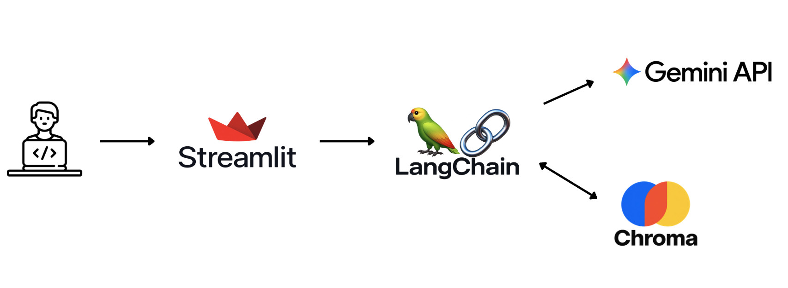

# 가입설계 챗봇

> ## 💬 모든 답변은, 근거 위에.

- **서비스명**: 가입설계 챗봇 (동양생명 FC 지원 AI 어시스턴트)
- **프로젝트 기간**: 2026.09.10 ~ (진행 중)
- **개발 인원**: 1명 (기획/개발, Claude Code·Codex와 페어 프로그래밍)
- **과제**: 코멘토 AI SWA 부트캠프 2차 과제 — 동양생명 "가입설계 자동화 챗봇 서비스 구축" RFP 프로토타입



<br>

# 목차

- [💡 기획 배경](#-기획-배경)
- [✨ 서비스 주요 기능](#-서비스-주요-기능)
- [🛠️ 프로젝트 핵심 기술](#core-tech)
- [🏗️ 시스템 아키텍처](#architecture)
- [🚀 로컬 실행 방법](#getting-started)
- [📁 프로젝트 구조](#structure)
- [☁️ 배포](#deploy)
- [⚠️ 알려진 제약사항](#limitations)
- [⚙️ 기술 스택](#tech-stack)

<br>

# 💡 기획 배경

### 상담 현장의 FC는, 답을 찾는 데 시간을 씁니다

동양생명 전속 설계사(FC) 1,000여 명은 상담 현장에서 고객에게 즉시 정확한
답변과 설계를 제시해야 합니다. 하지만 현실은 다음과 같은 어려움이 있습니다.

- 상품·특약별 약관이 방대해서, 필요한 조항을 그 자리에서 바로 찾기 어렵습니다.
- 확실하지 않은 내용을 임의로 답했다가 불완전판매로 이어질 위험이 있습니다.
- 고객 상황에 맞는 설계를 처음부터 구성하는 데 시간이 많이 소요됩니다.

이 문제를 해결하기 위해 아래 목표로 프로토타입을 개발했습니다.

- 약관 원문에 **근거해서만** 답하고, 근거가 없으면 솔직하게 "확인이 필요합니다"라고 말합니다.
- 답변의 신뢰도를 **수치로** 함께 보여줘 FC가 판단할 수 있게 합니다.
- 대화만으로 고객 맞춤 **가입설계**를 조립하고 즉시 수정할 수 있게 합니다.

<br>

# ✨ 서비스 주요 기능

RFP에서 도출한 5가지 핵심기능 중, Streamlit 프로토타입 범위에 맞는
4가지를 구현했습니다.

### 약관 기반 RAG 응답 + 할루시네이션 차단

- 보험 약관 PDF를 청크 단위로 나눠 임베딩하고 Chroma에 저장
- 질문이 들어오면 유사도 검색으로 관련 조항을 찾아 그 내용에 근거해서만 답변
- 근거가 없거나 관련성이 낮으면 "확인이 필요합니다"라고 답해 지어내지 않음
- 답변에 참고한 약관 페이지 번호를 함께 표시

### 확률적 근거 표시 (확신도 %)

- LLM이 확신도를 말로 지어내지 않고, 벡터 검색 거리값을 그대로 0~100% 확신도로 환산
- 형식이 깨질 위험도, 근거 없이 점수를 부풀릴 위험도 없는 결정론적 계산

### AI 가입설계 추천 (규칙 기반)

- FC가 입력한 고객 정보(나이·가족력·기존 가입상품·관심사)를 규칙 기반으로 점수화해 상품/특약 추천
- 추천 대상은 실제로 RAG에 인덱싱된 상품으로 한정해, 추천 이후 질문에도 근거 있는 답변 보장
- 추천 결과를 버튼 한 번으로 가입설계 상태에 반영

### 멀티턴 실시간 설계 수정

- "암진단비 특약 5천만원으로 넣어줘", "정기특약 빼줘" 같은 대화형 요청을 인식해 설계 상태를 실시간 갱신
- 사이드바에 현재까지 합의된 가입설계(주계약+특약)를 실시간으로 표시

멀티턴 대화 기록은 기본적으로 유지되며, 위 기능들과 무관하게 항상 동작합니다.

> **로드맵으로 남긴 기능**: 실제 고객 이력 데이터 기반 정교한 추천(ML 기반
> 고도화), 멀티채널 접속 + 사내 인증 연계는 이번 프로토타입 범위에 포함하지
> 않았습니다. 특히 후자는 연동할 실제 채널/인증 시스템이 없어 Streamlit
> 단일 앱 구조로는 구현할 수 없습니다.

<br>

<a id="core-tech"></a>

# 🛠️ 프로젝트 핵심 기술

### 결정론적 할루시네이션 차단

- 근거 채택 여부와 확신도 모두 **벡터 검색 거리값**에서 직접 계산합니다.
- LLM에게 "확신도를 %로 말해줘"라고 시키지 않는 이유: 형식을 안 지킬 수 있고, 근거 없이 숫자를 지어낼 위험이 있기 때문입니다.
- 실측 보정: 실제 관련 질문 거리 0.41~0.57, 무관한 질문 거리 0.64~0.77 — 이 간격을 기준으로 임계값(0.60)과 확신도 환산식을 튜닝했습니다.

### 무료 등급 임베딩 쿼터 대응 인프라

- Gemini 임베딩 API 무료 등급(하루 1,000건, 실측상 롤링 윈도우에 가까운 회복 패턴)에서 대량 문서(957페이지~)를 안전하게 인덱싱하기 위해 작은 배치 + 지수 백오프 + **소스 파일명 기반 안정 ID**로 언제 끊겨도 이어서 진행되는 인덱싱 스크립트를 직접 구현했습니다.
- 인덱스가 손상된 적이 있었는데(문서 추가로 청크 ID가 밀려 일부가 누락), 이미 계산된 임베딩 벡터를 텍스트 매칭으로 복구해 **API 호출 없이** 재구성하는 복구 스크립트도 만들었습니다.

### 대화형 상태 관리 (구조화 출력 파싱)

- 채팅 모델의 자연어 응답 끝에 사람 눈에는 안 보이는 JSON 블록(`design-update`)을 함께 출력하도록 지시하고, 이를 파싱해 세션의 가입설계 상태를 갱신합니다.
- 매 턴마다 "누적 diff"가 아니라 "전체 최신 상태"를 다시 출력하게 해서 병합 로직의 버그 위험을 없앴습니다.

### 모델 버전 고정

- `gemini-flash-latest` 같은 `-latest` 별칭은 시간이 지나면 자동으로 최신 모델을 가리키도록 바뀝니다. 실제로 개발 중 무료 등급 일일 한도가 단 20건뿐인 프리뷰 모델(`gemini-3.8-flash`)로 조용히 넘어간 것을 발견해, 검증된 버전(`gemini-3.6-flash`)을 명시적으로 고정했습니다.

<br>

<a id="architecture"></a>

# 🏗️ 시스템 아키텍처


사용자 질문이 Streamlit UI를 거쳐 LangChain으로 전달되면, LangChain이
Chroma에서 관련 약관 근거를 검색하고 그 근거 + 대화 기록을 Gemini API에
전달해 답변을 생성합니다. 생성된 답변은 참고 페이지·확신도와 함께
Streamlit 화면에 표시됩니다.

<br>

<a id="getting-started"></a>

# 🚀 로컬 실행 방법

### 1. 저장소 클론 및 가상환경 준비

```bash
git clone https://github.com/WooTaek-Oh/insurance-design-assistant.git
cd insurance-design-assistant
python3 -m venv .venv
source .venv/bin/activate   # Windows: .venv\Scripts\activate
pip install -r requirements.txt
```

Python 3.12 기준으로 개발/테스트되었습니다.

### 2. Gemini API 키 발급 및 설정

1. [Google AI Studio](https://aistudio.google.com/apikey)에서 무료 API 키를 발급받습니다.
2. 프로젝트 루트에 `.streamlit/secrets.toml` 파일을 만들고 아래처럼 키를 넣습니다.

```toml
GOOGLE_API_KEY = "발급받은_키_값"
```

이 파일은 `.gitignore`에 포함되어 있어 git에는 올라가지 않습니다. 절대
키 값을 커밋하지 마세요.

### 3. 앱 실행

```bash
streamlit run streamlit_app.py
```

브라우저에서 `http://localhost:8501` 로 접속하면 됩니다. 이미 인덱싱된
`chroma_db/`가 저장소에 포함되어 있어 별도 인덱싱 없이 바로 실행 가능합니다.

### 약관 문서 재인덱싱 (문서를 추가/교체했을 때만)

`docs/` 폴더의 PDF를 추가하거나 교체한 경우에만 아래 스크립트를 다시
실행하면 됩니다. 평소 앱을 실행할 때는 필요하지 않습니다.

```bash
python scripts/build_index.py
```

- 기존에 이미 임베딩된 청크는 건너뛰고 이어서 진행합니다 (재실행 안전).
- 처음부터 다시 만들고 싶다면 `python scripts/build_index.py --rebuild`를 실행하세요.

> **참고**: Gemini 임베딩 API 무료 등급은 하루 1,000건의 요청 한도가
> 있습니다. 이 한도는 고정된 자정 리셋이 아니라 **최근 24시간 롤링
> 윈도우**처럼 동작하는 것으로 보여서, 하루가 바뀌어도 곧바로 1,000건이
> 통째로 채워지지 않고 서서히(또는 불규칙하게) 풀릴 수 있습니다. 대량
> 인덱싱 일정을 짤 때 여유를 두세요. 앱을 실제로 사용할 때(질문 1건당
> 임베딩 1회)는 이 한도에 거의 영향을 받지 않습니다.

<br>

<a id="structure"></a>

# 📁 프로젝트 구조

```
.
├── streamlit_app.py       # 메인 앱 (채팅 UI + RAG 응답 + 설계/추천 사이드바)
├── rag.py                 # RAG 공용 모듈 (PDF 로딩/청킹/임베딩/검색/확신도)
├── design_state.py        # 멀티턴 가입설계 상태 파싱/관리
├── recommendation.py      # 규칙 기반 상품/특약 추천 엔진
├── scripts/
│   └── build_index.py     # 약관 PDF 인덱싱 스크립트 (1회성/재실행 가능)
├── docs/                  # 인덱싱 대상 약관 PDF
│   └── _pending/          # 아직 인덱싱 안 한 대용량 약관 (분량이 커서 보류)
├── assets/                # README용 이미지
├── chroma_db/             # 미리 빌드해둔 벡터 인덱스 (git에 포함)
├── requirements.txt
└── .streamlit/
    └── secrets.toml       # API 키 (로컬 전용, git에 미포함)
```

<br>

<a id="deploy"></a>

# ☁️ 배포

1. GitHub 저장소를 Streamlit Community Cloud에 연결합니다.
2. Main file path를 `streamlit_app.py`로 지정합니다.
3. App settings → Secrets에 아래 내용을 등록합니다.

```toml
GOOGLE_API_KEY = "발급받은_키_값"
```

4. `main` 브랜치에 push하면 자동으로 재배포됩니다. 벡터 인덱스(`chroma_db/`)가
   저장소에 이미 포함되어 있어 배포 시 재임베딩 없이 바로 로드됩니다.

<br>

<a id="limitations"></a>

# ⚠️ 알려진 제약사항

- 무료 등급 Gemini API의 요청 한도로 인해, 대량의 문서를 새로 인덱싱할 때는
  하루 이상(문서 분량에 따라 며칠) 걸릴 수 있습니다. 페이지 수가 수천
  페이지에 달하는 약관(`docs/_pending/`에 보류 중인 건강보장보험·종신보험)은
  전체 인덱싱에 1~2주가 걸릴 수 있어 이번 프로토타입에서는 제외했습니다.
- 현재 인덱싱된 상품(3종, 총 2,960개 청크): 암보험(무배당우리WON하는암보험,
  100%), 연금보험(무배당우리WON하는누구나행복연금보험, 약 98%), 실손의료비
  (무배당우리WON하는급여실손의료비보장보험, 약 86%). 연금·실손 일부 조항은
  무료 등급 쿼터 한도로 아직 인덱싱되지 않았으며, 해당 부분에 대한 질문은
  "확인이 필요합니다"로 안전하게 응답합니다. 추천 엔진도 이 세 상품만
  대상으로 합니다.
- 규칙 기반 추천은 실제 고객 이력 데이터가 아닌 더미 입력을 사용합니다.
- 멀티채널 접속 + 인증 연계는 연동할 실제 채널/인증 시스템이 없어
  Streamlit 단일 앱 구조로는 구현 범위에 포함하지 않았습니다.

<br>

<a id="tech-stack"></a>

# ⚙️ 기술 스택

### Frontend / Backend
Streamlit

### Orchestration
LangChain

### AI
Google Gemini API (`gemini-3.6-flash`), Google Gemini Embedding API (`gemini-embedding-001`)

### Data
Chroma (벡터스토어)

### Infra
Streamlit Community Cloud, GitHub
